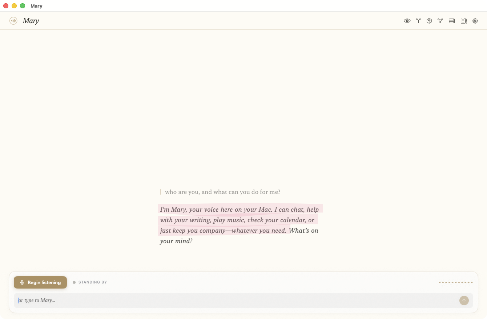
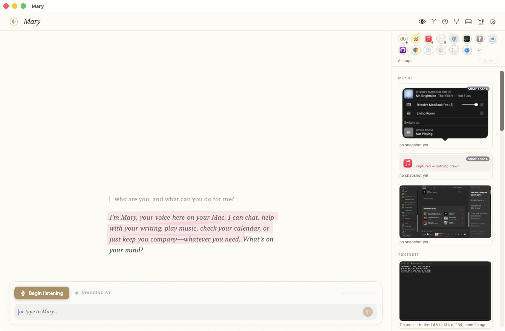
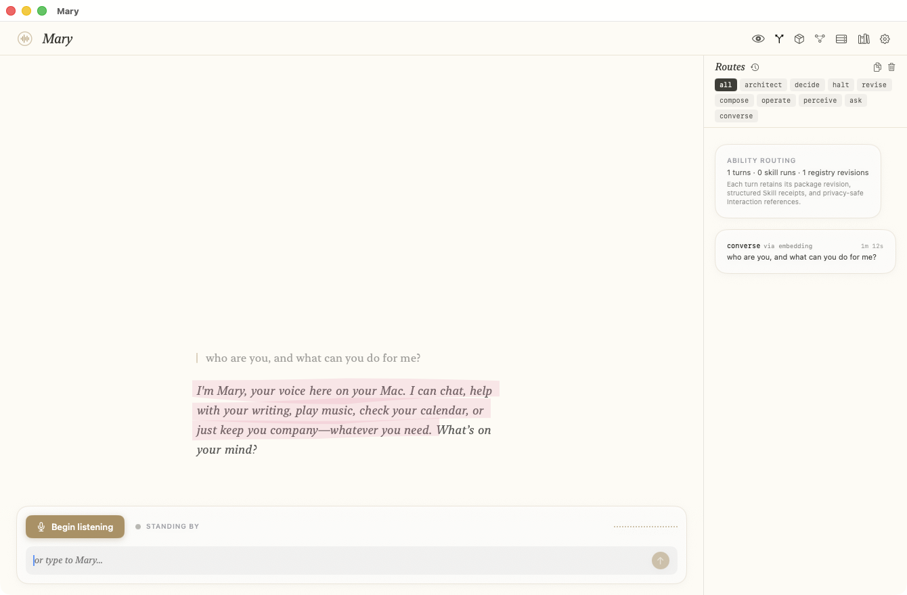
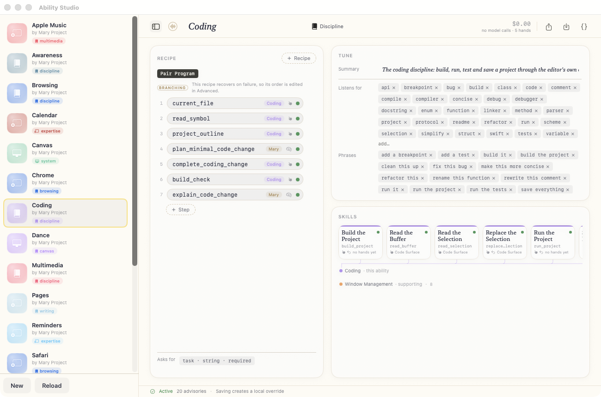
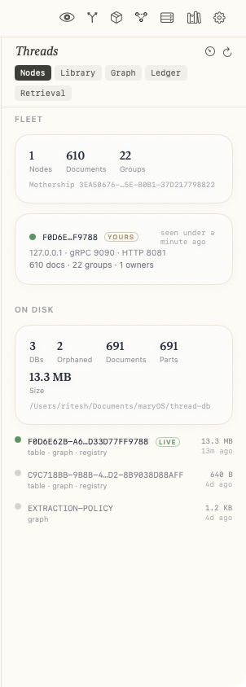
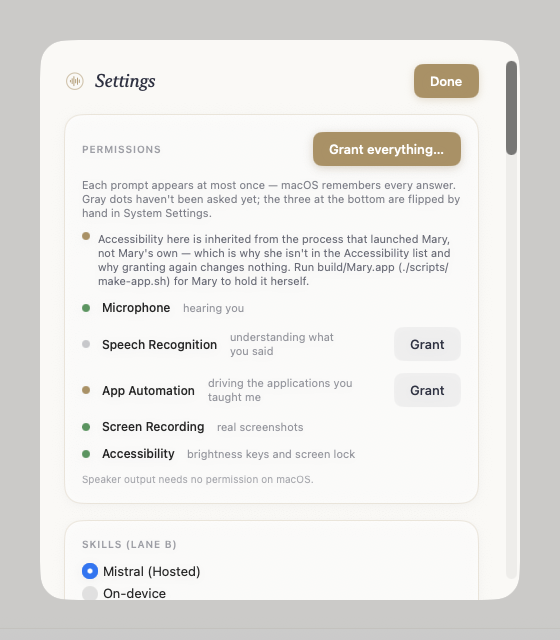

# Mary

A macOS ambient-intelligence assistant. Mary perceives your screen through the
accessibility tree, carries out declarative **Plugins** by voice, speaks through
Sewn, and remembers through Thread.



## What she is

You talk; she acts on the machine in front of you. What separates that from a
chat window is that Mary has already read the screen before the sentence ends —
which window is frontmost, what the selection holds, what the cursor sits
inside — so *"change the second paragraph"* resolves to a paragraph instead of
becoming a question.

Say **"Hey Mary"** or type. Transcription is on-device (`SpeechAnalyzer`), the
reply is spoken by an on-device Kokoro voice, and every generation rides Sewn —
so no model is ever loaded in this process.

What she can *do* is not compiled in. Seventeen declarative ability packages
under `Abilities/` — **131 skills** across five disciplines, nine application
expertises and three system controls — describe an application, the skills it
offers, and the recipes that carry them out. No Swift file anywhere names a
target application.

## What she can do

| | |
|---|---|
| **Disciplines** | Coding (42 skills) · Writing (31) · Browsing (22) · Multimedia (9) · Awareness (5) |
| **Application expertise** | Xcode · Pages · Scrivener · TextEdit · Safari · Chrome · Apple Music · Calendar · Reminders |
| **System control** | Window Management (8) · Canvas (2) · Dance (3) |

A discipline is the verb and an application joins it by declaring the surface it
offers — so "read the selection" reaches Xcode and Scrivener through the same
skill, and teaching Mary a new editor is a `.mary` file, not a pull request.

## What you can watch her do

Every stage of a turn has a window onto it. That is deliberate: a screenshot of
these panes is a bug report.

### She sees what you see



Tier 0 is the accessibility walk — every window Mary can *and cannot* see,
grouped by application, each with the snapshot she is holding and how old it is.
A stale fact renders with its age and loses authority; a stale surface is
dropped outright, because a screen that may no longer exist is a confidently
wrong answer waiting for a question.

### She routes before she reasons



One semantic read classifies the turn — architect, decide, halt, revise,
compose, operate, perceive, ask, converse — and the pane records what was
decided, what decided it, and how long it took. The `converse via embedding`
above is a turn settled with no model call at all; when exactly one skill is
confident, dispatch happens the same way.

### You teach her, and you watch her learn it



The Ability Studio is the authoring surface for a `.mary` package: the recipe
and its steps, who owns each one, the phrases and tokens the ability listens
for, and the skills it exposes. Packages export and import as single files, and
saving creates a local override rather than editing what shipped.

### She remembers, and the memory is inspectable



Memory lives in a local Thread node — documents, groups, the knowledge graph
built from them, and the ledger of what retrieval actually did with them. The
pane is a read window; storing and retrieving happen on the turn.

### Permissions and engines are yours to set



Each macOS permission is asked at most once and is shown with what it buys.
Lane A (the voice) and Lane B (the skills) pick their engines independently —
hosted through Sewn, or Sewn's own on-device model. Whichever you pick, the
skills themselves always run on this Mac; only the synthesis moves.

## Three commitments

**Every plugin is a plugin.** A Plugin is a declarative package: one `.mary`
file under `Abilities/` describing an application, the skills it offers, and the
recipes that carry them out. There is no "native plugin" concept — no Swift file
anywhere names a target application. The compiled providers that satisfy what a
Plugin declares are **adapters**, they are generic by construction, and the word
"plugin" never names Swift code.

**Accessibility is tier 0.** The ambient context store takes the AX surface —
what is actually on screen right now — as its foundation, with per-application
facts layered on top and selection/attention above that. The walk that produces
it is the floor of `MaryComputerUse`, which owns everything Mary does *to* the
machine as well as everything she reads from it — see `docs/computer-use.md`. A stale fact renders
with its age and loses authority, because held knowledge ages honestly. A stale
surface is *dropped*, because a screen that may no longer exist is a confidently
wrong answer waiting for a question.

**Ambient intelligence is the philosophy.** Mary's job is to already know what
you are looking at, so that "change the second paragraph" needs no explanation.

Mary is a re-architecture of [Bonnie](https://github.com/rao-studios/Bonnie) —
the same ideas, cut down to their load-bearing shape.

## The core repositories

Mary is the client. The rest of the system lives in sibling repositories, and
these are the ones to keep checked out and current when working on MaryOS.

| Repo | What it is | What Mary uses it for |
|---|---|---|
| **[Sewn](https://github.com/rao-studios/Seer)** | The orchestration server (Swift on Hummingbird 2): authentication, chat completions, sentiment-tuned generation, attribution and royalty accounting, and fan-out to Thread nodes. | Every generation. Both lanes of the turn ride Sewn, which is why no model is ever loaded in Mary's process. |
| **[Thread](https://github.com/rao-studios/Totem)** | A distributed vector-search and knowledge-graph node. Documents are chunked, embedded to 1024 dimensions, product-quantized, and folded into a graph of entities and relationships. | Memory. `MaryThread` is the gRPC facade onto the local node; the Threads pane is the read window onto it. |
| **[Conduit](https://github.com/rao-studios/Conduit)** | The wire between a mothership and its nodes — one canonical set of `.proto` files, the generated types, and the session/client/server machinery. A library; it ships no executable. | The gRPC contract (`thread.v1`). **A SwiftPM path dependency: `../Conduit` must sit beside this repository.** |
| **[Fleet](https://github.com/rao-studios/Fleet)** | LoRA-gated JSON state machines. Trains LoRA adapters on small on-device LLMs so output conforms to a fixed schema, and enforces that schema while decoding. | Life — the training runs that learn from recent turns and publish adapters. |
| **[Frigate](https://github.com/rao-studios/Frigate)** | On-device embeddings and LLM inference on MLX, plus `FrigateVisionAX`, the bundled ONNX region classifier. | Embedding-based routing, and the page classifier behind VisionAX. **A SwiftPM path dependency: `../Frigate` must sit beside this repository.** |

> **A naming note.** Seer was renamed to **Sewn** and Totem to **Thread**
> throughout the code, the protos, the config keys and the local checkouts — but
> the GitHub repositories still carry the old names, which is why the two links
> above read `Seer` and `Totem`.

Only `../Frigate` and `../Conduit` are needed to *build* Mary; Sewn, Thread and
Fleet are services she talks to at runtime.

## Toward MaryOS on Linux

Neither of these is required to build or run Mary on macOS. They are where the
assistant stops being an app on someone else's desktop and becomes the desktop.

| Repo | What it is |
|---|---|
| **[MaryPi](https://github.com/rao-studios/MaryPi)** | Two kits for putting an operating system on a Raspberry Pi 5 from a Mac — each builds an image, boots it in a VM on the Mac first, and writes it to an SD card. The active one is **MaryOS**, an Ubuntu 24.04 (Noble) arm64 fork built from source; the ravynOS (XNU/Darwin) bring-up is kept as it landed. |
| **[MaryUI](https://github.com/rao-studios/MaryUI)** | The desktop-first design system, theme **Liquid Platinum**. A React reference implementation of the whole desktop, and the same system in C — `libmaryui` plus `maryui-desktop`, a wlroots compositor that *is* the desktop. |

## Status

Under construction, in stages. Stage 0 (scaffold, doctrine tests, signing) is
in. See `~/.claude/plans/we-have-implemented-all-atomic-sutton.md` for the
staged plan.

Test plans name the destination, not the incident pile:

- `TestPlans/Mary-Doctrine.xctestplan` — standing rules (layering, admission, purity). Always expected green.
- `TestPlans/Mary.xctestplan` — Doctrine plus perceive / speak-listen / teach-act / turn. Daily run.
- Live AX, voice, corpus, and media stay in the `mary-*-probe` tools.

## Building

Requires macOS 26 (the floor is `SpeechAnalyzer`, the only API for long-form
continuous on-device transcription) and sibling checkouts of `../Frigate` and
`../Conduit` alongside this repository once those stages land.

```sh
swift build
swift test
./scripts/dev.sh          # build, stable-sign, run
CONFIG=release ./scripts/dev.sh
./scripts/make-app.sh     # build/Mary.app
./scripts/sand.sh         # the wireframe + ability bench (its own TCC identity)
./scripts/sand.sh --target com.apple.TextEdit   # open straight onto one app
```

**Use `./scripts/dev.sh`, not `swift run`.** SwiftPM signs the built binary
ad-hoc, and an ad-hoc identity *is* the binary's cdhash — it changes on every
build, so macOS treats each rebuild as a brand-new app. The System Settings
checkbox still looks enabled while `AXIsProcessTrusted()` quietly returns false.
`scripts/sign-binary.sh` re-signs with a stable certificate (an Apple
Development identity, or a self-made one named `Mary Dev Signing`) so the
designated requirement is identifier + certificate rather than a hash, and one
Accessibility grant survives every rebuild. The Xcode scheme carries the same
logic inlined in a **launch pre-action** — pure SwiftPM packages have no build
phases, and `SRCROOT` does not resolve in scheme actions, so only
`BUILT_PRODUCTS_DIR` works there.

Adapter-backed skills need permissions the *bundle* holds, not the bare binary:
run `./scripts/make-app.sh` and launch `build/Mary.app` when you want App
Automation and the rest to actually answer.

Kokoro's speech models (~665 MB) are tracked with git-lfs; run
`git lfs install` before cloning or the voice target builds against
placeholder files.

## Layout

One SwiftPM package, targets under `Sources/`, layered strictly:

| Target | What it is |
|---|---|
| `MaryFoundation` | The schema layer: Plugin grammar, codec + integrity digest, value envelopes, `AXFrame` geometry. Depends on nothing. |
| `MaryAmbient` | The ambient paradigm: the tiered context store, realms, surfaces, passages, focus and reference resolution. Depends on `MaryFoundation` **alone** — that is what makes it portable, and a test enforces it. |
| `MaryComputerUse` | The machine layer: the accessibility tree engine (tier 0), derived sight, hands (keyboard, pointer, elements, windows, menus, media keys), stage arbitration, subprocess, and one monitor. The only target that posts an input event, performs an accessibility action, or captures pixels — and a test reads every source file to keep that true. |
| `MaryPlugin` | The adapter contract and the generic adapters (surface, typer, prose-surface, window management, media, corpus). Adapters translate what a Skill needs into hands and sight; they do not reach the machine themselves. |
| `MaryVoice` | Mic → VAD → transcription → a `LanguageResponder` seam → speech, every stage observable. |
| `MaryBrain` | Reasoning: the dual-lane turn, the Plugin pipeline, the Sewn clients. Every generation rides Sewn — Mistral, Thinking Machines, or Sewn's own on-device model — so no model is ever loaded in this process. |
| `MaryThread` | The gRPC facade onto the local Thread node. Consumed only by the runtime and the app. |
| `MaryRuntime` | The composition root, long-lived actors, and Granite services. |
| `Mary` | The SwiftUI app. |
| `Sand` | The bench: a live accessibility wireframe of any running app, and one taught ability — its own recipes, or any skill it realizes for a discipline it extends — dispatched through the real `AbilityRuntime` so the route it takes into `MaryComputerUse` is watchable act by act. Its own bundle id, so its Accessibility grant is independent of Mary's. `./scripts/sand.sh` to run it. |

Those rules are not conventions — `Tests/MaryFoundationTests/PackageLayeringTests.swift`
reads `Package.swift` as text and fails the build when an edge appears that
should not, because SwiftPM offers no build-time hook for "this target may not
depend on that one" and a wrong edge forms no cycle: it compiles, links, ships,
and the boundary is simply gone.

## The turn

One file runs a turn: `Sources/MaryBrain/Brain/MaryBrain+Turn.swift`. A walking
route through it, stage by stage, is in [`docs/turn/`](docs/turn/README.md).
