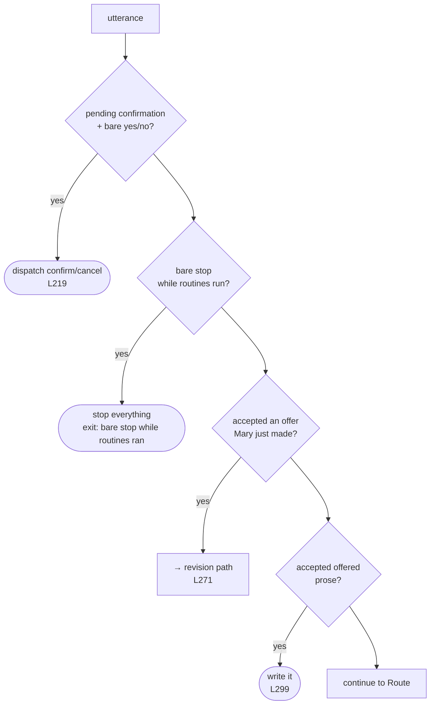

# 2 · Decide

← [Entry](1-entry.md) · [Map](README.md) › **Decide** › [Route](3-route.md) →

**Lines 203–335** · four ways a turn ends before a model is ever asked

---

This stage is cheap on purpose. Each block below answers the turn outright and
returns. Only an utterance that survives all four reaches the router.

## The four

**1 · A parked action + a bare yes/no** —
[L219](../../Sources/MaryBrain/Brain/MaryBrain+Turn.swift#L219).
If a Skill is waiting on approval and the person said just "yes" or "no", that
is not the model's decision to make. It dispatches confirm or cancel directly
and keeps `decisionOutcome`, which every block below tests against.

**2 · A bare "stop" while routines run** —
[L234](../../Sources/MaryBrain/Brain/MaryBrain+Turn.swift#L234).
One stop halts *everything*. A deliberate product decision: no disambiguation
grammar, no "which one?". → **exit `bare stop while routines ran`**
([L247](../../Sources/MaryBrain/Brain/MaryBrain+Turn.swift#L247)).

**3 · A new topic while routines run** —
[L253](../../Sources/MaryBrain/Brain/MaryBrain+Turn.swift#L253).
Not an exit. Changing the subject reads as "they landed — move on", so
all-OK routines settle silently from here. Failures still speak.

**4 · An accepted offer** —
[L271](../../Sources/MaryBrain/Brain/MaryBrain+Turn.swift#L271).
"yes please" to something Mary just proposed becomes a revision intent, above
everything else that reads intent. And at
[L299](../../Sources/MaryBrain/Brain/MaryBrain+Turn.swift#L299), accepted
*prose* takes the write path and returns — it does not fall through.

## Shape, decided once

[L268](../../Sources/MaryBrain/Brain/MaryBrain+Turn.swift#L268) —
`EditIntentClassifier.intent(…)`, the stricter and more conservative of the two
intent reads. Combined at [L282](../../Sources/MaryBrain/Brain/MaryBrain+Turn.swift#L282)
with the accepted offer's own shape into one `editIntent` that the rest of the
turn reads rather than re-deriving.

> **PIN worth knowing.** A revision *is* an action. Saying so here is the other
> half of "commit to it right away" — it is why a revise turn behaves like an
> operate turn all the way down.

## Exits from this stage

| Exit | Line |
|---|---|
| `bare stop while routines ran` | [L247](../../Sources/MaryBrain/Brain/MaryBrain+Turn.swift#L247) |

Plus the offered-prose write path, which closes the turn at
[L299](../../Sources/MaryBrain/Brain/MaryBrain+Turn.swift#L299) without a named exit.

## Calls out to

`DeterministicTier` · `EditIntentClassifier` · `OfferedProse`
([OfferedProse.swift](../../Sources/MaryBrain/Brain/OfferedProse.swift)) ·
`stopAllRoutines` · `AbilityDispatching.hasPendingSkillConfirmation`

---

← [1 · Entry](1-entry.md) · Next: [3 · Route](3-route.md) →
