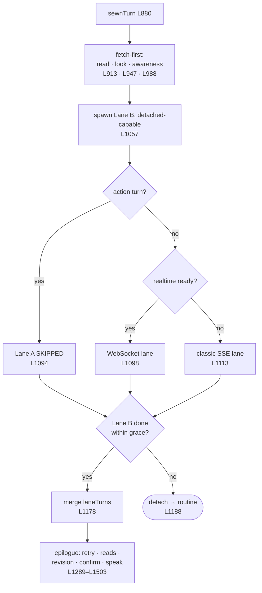

# 5 · The Sewn turn

← [Prepare](4-prepare.md) · [Map](README.md) › **Sewn turn** › [Lane A](6-lane-a.md) · [Lane B](7-lane-b.md) →

**Lines 880–1566** · `sewnTurn` — the dual-lane coordinator

---

The longest function in the file, and the one that earns it. Two lanes run
**concurrently**: one talks, one acts. Neither does the other's job. This
function spawns them, decides how long the turn waits, and writes the epilogue.

## Fetch-first — answering before the model

[L913](../../Sources/MaryBrain/Brain/MaryBrain+Turn.swift#L913) onward. On a
turn that is *not* an action and has no edit intent, three reads may run before
either lane starts, each recorded so the lanes know it already happened:

| Read | Line | Sets |
|---|---|---|
| Passage / buffer read | [L913](../../Sources/MaryBrain/Brain/MaryBrain+Turn.swift#L913) | `readPassages`, `readServed` |
| Screen look | [L947](../../Sources/MaryBrain/Brain/MaryBrain+Turn.swift#L947) | `lookServed`, `lookUnderway` |
| Awareness — the unit they are inside | [L988](../../Sources/MaryBrain/Brain/MaryBrain+Turn.swift#L988) | `awareness`, `awarenessServed` |

A **read outranks a look**: the voice already holds actual content, not a
glance. Lane B is told via `servedByRead` / `servedByPreLook` so it does not
spend a round re-fetching.

## Spawning Lane B first

[L1057](../../Sources/MaryBrain/Brain/MaryBrain+Turn.swift#L1057). Lane B starts
*before* Lane A, carrying a `LaneEmitter` and a `LaneAttachment`
([BrainConcurrency.swift:176](../../Sources/MaryBrain/Brain/BrainConcurrency.swift#L176)).
The attachment is the flag that says whether anyone is still waiting.

`laneSeed = history` — Lane B buffers its own turns into a private `laneHistory`
and merges them at join, so a tool_use/tool_result pair can never be orphaned by
an epoch flip.

## Choosing Lane A's transport

[L1094](../../Sources/MaryBrain/Brain/MaryBrain+Turn.swift#L1094).

- **Action turn → no Lane A at all.** No Sewn stream, no "I'm on it", no TTS.
  The Skill chips *are* the reply.
- **Realtime ready → WebSocket** ([L1098](../../Sources/MaryBrain/Brain/MaryBrain+Turn.swift#L1098)).
  A realtime failure *before any event* falls back to classic and reruns.
- **Otherwise → classic SSE** ([L1113](../../Sources/MaryBrain/Brain/MaryBrain+Turn.swift#L1113)).

Both runners live in [6 · Lane A](6-lane-a.md).

## The join race — the heart of it

[L1144](../../Sources/MaryBrain/Brain/MaryBrain+Turn.swift#L1144), using
[`laneFinished(signal:grace:)`](../../Sources/MaryBrain/Brain/MaryBrain+Turn.swift#L1546).

| Situation | Grace |
|---|---|
| Lane A said nothing | Lane B is **fully awaited** |
| Lane A spoke | 250 ms ([MaryBrain.swift:187](../../Sources/MaryBrain/Brain/MaryBrain.swift#L187)) |
| Action turn | 5 s ([MaryBrain.swift:193](../../Sources/MaryBrain/Brain/MaryBrain.swift#L193)) |

Three outcomes:

1. **Joined** ([L1178](../../Sources/MaryBrain/Brain/MaryBrain+Turn.swift#L1178)) — merge `laneTurns`, keep the outcomes, write the epilogue.
2. **Detached** ([L1188](../../Sources/MaryBrain/Brain/MaryBrain+Turn.swift#L1188)) — the turn completes *now*; the lane becomes a registered routine and reports through the proactive channel when it finishes. `laneAttachment.detach()` flips **before** registration, so the lane's very next round already knows it is background work.
3. **Stalled** ([L1169](../../Sources/MaryBrain/Brain/MaryBrain+Turn.swift#L1169)) — it blew the watchdog cap and was cancelled. Deliberately *not* promoted to a routine: that would only buy it a second seven minutes to fail in.

## The epilogue

Once both lanes have settled, the turn assembles what to say —
[L1289](../../Sources/MaryBrain/Brain/MaryBrain+Turn.swift#L1289) through
[L1503](../../Sources/MaryBrain/Brain/MaryBrain+Turn.swift#L1503), in order:

| Step | Line |
|---|---|
| Action retry — the lane ran nothing on an acting turn | [L1289](../../Sources/MaryBrain/Brain/MaryBrain+Turn.swift#L1289) |
| Server voiced? hand speech back to the local voice | [L1359](../../Sources/MaryBrain/Brain/MaryBrain+Turn.swift#L1359) |
| Lane A failed and said nothing — fall back to Lane B's prose | [L1371](../../Sources/MaryBrain/Brain/MaryBrain+Turn.swift#L1371) |
| A Skill asked the person — that question *is* the reply | [L1422](../../Sources/MaryBrain/Brain/MaryBrain+Turn.swift#L1422) |
| Joined reads spoken back, header dropped, clamped | [L1452](../../Sources/MaryBrain/Brain/MaryBrain+Turn.swift#L1452) |
| Revision report — what actually changed | [L1466](../../Sources/MaryBrain/Brain/MaryBrain+Turn.swift#L1466) |
| A CONFIRM park, spoken deterministically after the reply | [L1477](../../Sources/MaryBrain/Brain/MaryBrain+Turn.swift#L1477) |
| What gets remembered vs. what got said | [L1486](../../Sources/MaryBrain/Brain/MaryBrain+Turn.swift#L1486) |

## The three lane types

Declared here, at the top of the section:

- [`SewnLaneResult`](../../Sources/MaryBrain/Brain/MaryBrain+Turn.swift#L816) — Lane A's text, contribution, auto-memory flag, failure bit.
- [`LaneOutcome`](../../Sources/MaryBrain/Brain/MaryBrain+Turn.swift#L826) — one dispatched Skill's *settled* outcome. It **carries** the `SkillOutcome` rather than re-spelling it: restating these fields per construction site is how `foundNothing` once got dropped on the last hop.
- [`OrchestratorLaneResult`](../../Sources/MaryBrain/Brain/MaryBrain+Turn.swift#L857) — Lane B's whole yield, including the buffered `laneTurns`.

## Calls out to

`SewnChatProviding` · `SewnRealtimeProviding` · `OwnActCollector` ·
`ScreenLookFaculty` · `RetrievalTraceLedger` ·
`revisionReport` ([MaryBrain+Route.swift](../../Sources/MaryBrain/Brain/MaryBrain+Route.swift)) ·
`spokenReadBack` ([MaryBrain+GroundedText.swift](../../Sources/MaryBrain/Brain/MaryBrain+GroundedText.swift)) ·
`finishRoutine` ([MaryBrain+FinishRoutine.swift](../../Sources/MaryBrain/Brain/MaryBrain+FinishRoutine.swift))

---

← [4 · Prepare](4-prepare.md) · Next: [6 · Lane A](6-lane-a.md) →
