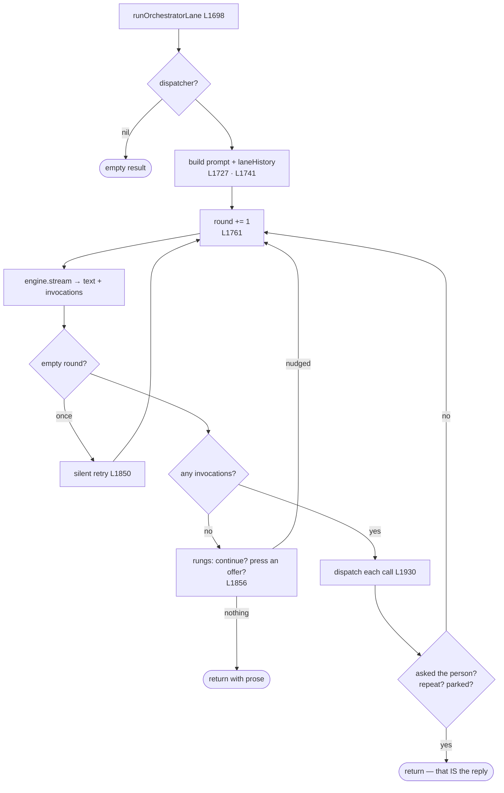

# 7 · Lane B — the acts

← [Lane A](6-lane-a.md) · [Map](README.md) › **Lane B** › [Engine seat](8-engine-seat.md) →

**Lines 1694–2102** · `runOrchestratorLane`

---

Lane B **acts and does not speak**. A silent Skill loop: up to
`maxSkillRounds = 10` rounds of *ask the model → dispatch what it named → tell
it what happened*. Its prose is kept only as an offline fallback for
[the epilogue](5-sewn-turn.md#the-epilogue).

## The private history

[L1741](../../Sources/MaryBrain/Brain/MaryBrain+Turn.swift#L1741) —
`var laneHistory = seed`. **This is the key structural fact about Lane B.** It
never writes to shared history mid-lane. Everything it says to itself — nudges,
tool results, retries — lives here and is batch-merged at join.

That is why Lane B needs no equivalent of `pruneSyntheticTurns`, and why
[the engine seat](8-engine-seat.md), which *does* append to shared history, does.

## The prompt it builds

[L1727](../../Sources/MaryBrain/Brain/MaryBrain+Turn.swift#L1727) — the system
prompt plus `MaryPrompts.orchestratorAddendum`, then conditionally: a
selection-revision instruction, the located passage brief, and a note saying a
read or a look already served this turn.

## The rungs — what happens when the model calls nothing

[L1856](../../Sources/MaryBrain/Brain/MaryBrain+Turn.swift#L1856). A round with
no invocations is not automatically the end:

- **The continuation nudge** — the lane only *read* or *prepared* on a turn that
  asked for something DONE. One more round, once. Latched: a turn may be nudged
  once, not once per reason.
- **The affordance escape** — the screen was offering a control the whole time.
  Name it once, then press it if it clears the confident floor.
- **Otherwise** — return, keeping the prose.

A turn whose work **landed** is never nudged. The receipt is the whole point:
`landed` is the browsing lane's proof that the asked-for change happened, and a
lane that nudges anyway spends a round asking for work already done.

## Guards on the dispatch loop

[L1930](../../Sources/MaryBrain/Brain/MaryBrain+Turn.swift#L1930) onward, each
call passes the repeat guard
([MaryBrain+RepeatGuard.swift](../../Sources/MaryBrain/Brain/MaryBrain+RepeatGuard.swift))
before it runs:

| Guard | Meaning |
|---|---|
| Same call, same arguments, already failed | Refuse — do not repeat with the same words |
| An unproven act, no look since | Hold until something looks |
| Different words, or different key order | **Not** a repeat — allowed |

Then three ways the lane ends early:

| Ends because | Line |
|---|---|
| A Skill asked the person — the question *is* the reply | [L2065](../../Sources/MaryBrain/Brain/MaryBrain+Turn.swift#L2065) |
| A call was re-issued verbatim after failing | [L2069](../../Sources/MaryBrain/Brain/MaryBrain+Turn.swift#L2069) |
| A CONFIRM parked and is waiting on approval | [L2072](../../Sources/MaryBrain/Brain/MaryBrain+Turn.swift#L2072) |

## Also here

[`selectionInvocation`](../../Sources/MaryBrain/Brain/MaryBrain+Turn.swift#L2088)
— shared with the engine seat, which is why it is a static rather than a local.

## Calls out to

`AbilityDispatching.dispatch` → [AbilityRuntime+Dispatch.swift](../../Sources/MaryBrain/Abilities/Runtime/AbilityRuntime+Dispatch.swift) ·
`actingEvents` ([MaryBrain+Life.swift](../../Sources/MaryBrain/Brain/MaryBrain+Life.swift)) ·
`RevisionVeto` / `WorldVeto` ([MaryBrain+Types.swift](../../Sources/MaryBrain/Brain/MaryBrain+Types.swift)) ·
`AffordanceProbe` · `MaryPrompts` · `RoutingHabitRecordingContext`

---

← [6 · Lane A](6-lane-a.md) · Next: [8 · The engine seat](8-engine-seat.md) →
