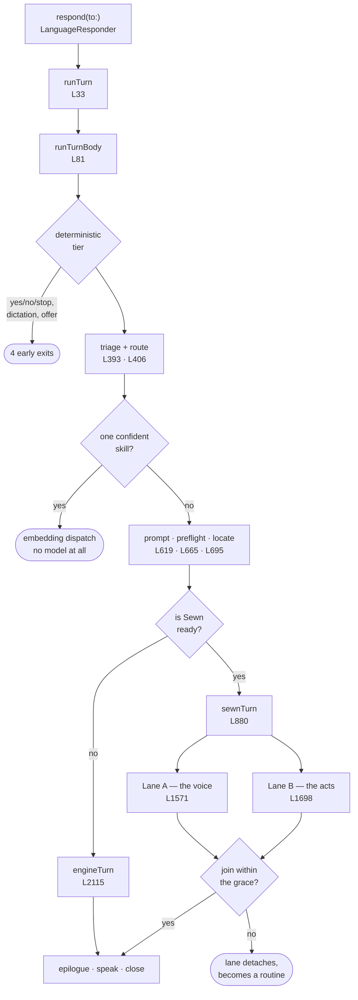

# The Turn — a map

One file runs a turn: [`Sources/MaryBrain/Brain/MaryBrain+Turn.swift`](../../Sources/MaryBrain/Brain/MaryBrain+Turn.swift).
2,739 lines, 15 functions, one `extension MaryBrain`. This folder is a walking
route through it.

It used to be six files. Following one turn meant following one call chain
across all six, so they are one file again — and this map is the index that
file's own header used to be.

**What the file is:** the *control flow* of a turn. It declares 3 types and
calls 212 functions it does not own. It is the join, not the substance — see
[Where the file stops](11-beyond.md).

---

## The whole turn, in one picture

---

## The stages

Walk them in order, or jump.

| # | Stage | Lines | What happens |
|---|---|---|---|
| 1 | [Entry](1-entry.md) | 33–202 | Task-locals bound, supersede resolved, the exchange opens |
| 2 | [Decide](2-decide.md) | 203–335 | The deterministic tier — four ways out before any model runs |
| 3 | [Route](3-route.md) | 336–504 | The one semantic read, and the route it produces |
| 4 | [Prepare](4-prepare.md) | 505–753 | No-model dispatch, prompt, preflight, locate — **and the fork** |
| 5 | [Sewn turn](5-sewn-turn.md) | 880–1566 | Dual lane: spawn, transport, join or detach, epilogue |
| 6 | [Lane A — the voice](6-lane-a.md) | 1568–1693 | Streams the spoken reply. Never acts |
| 7 | [Lane B — the acts](7-lane-b.md) | 1694–2102 | The silent Skill loop. Never speaks |
| 8 | [The engine seat](8-engine-seat.md) | 2104–2652 | `engineTurn` — no Lane A, so one loop does both |
| 9 | [Dispatch](9-dispatch.md) | 2654–2738 | The ceremony every dispatch shares |

Cross-cutting:

- [**Every exit**](10-exits.md) — all nine ways a turn can end, and which stage owns each
- [**Where the file stops**](11-beyond.md) — the 212 calls out, and the six modules behind them

---

## How to read the source alongside this

The file marks its own seams. Three conventions carry most of the meaning:

- `// MARK: -` — the six former files, in call order.
- `// internal for file split — treat as private` — a member that is `internal`
  only because it used to live in another file. Not API.
- `/// PIN:` — a decision with a reason, usually a measured one. When a PIN and
  your intuition disagree, the PIN has a bug report behind it.

## Vital statistics

| | |
|---|---|
| Lines | 2,739 |
| Functions declared | 15 |
| Types declared | 3 (`SewnLaneResult`, `LaneOutcome`, `OrchestratorLaneResult`) |
| Distinct calls made | 227 — **212 defined elsewhere** |
| Project types referenced | 106, defined across 79 files |
| Modules reached | 6 — every layer `MaryBrain` may legally see |
| Rounds per lane | `maxSkillRounds = 10` ([MaryBrain.swift:357](../../Sources/MaryBrain/Brain/MaryBrain.swift#L357)) |
| Lane join grace | 250 ms, or 5 s on an action turn ([MaryBrain.swift:187](../../Sources/MaryBrain/Brain/MaryBrain.swift#L187)) |

→ Start at [**1 · Entry**](1-entry.md)
